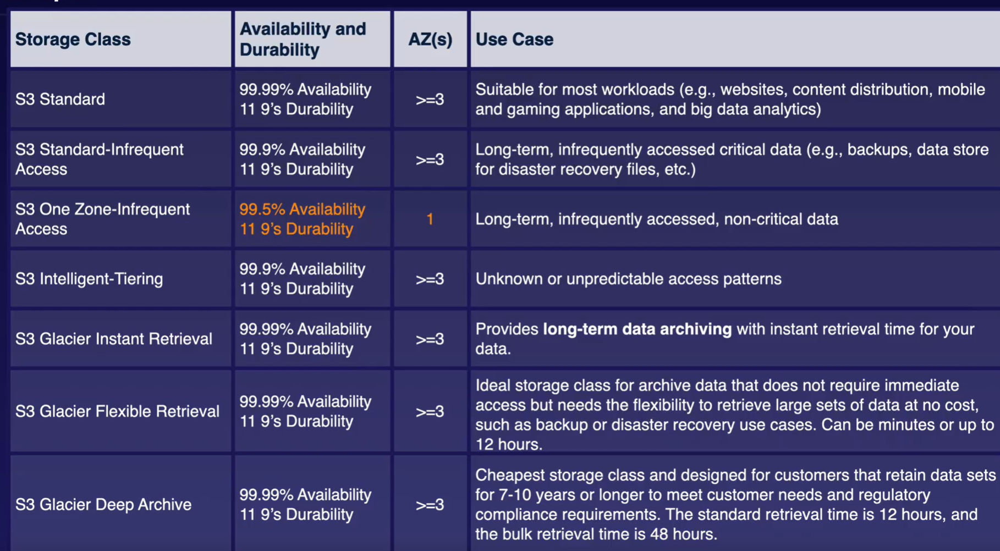
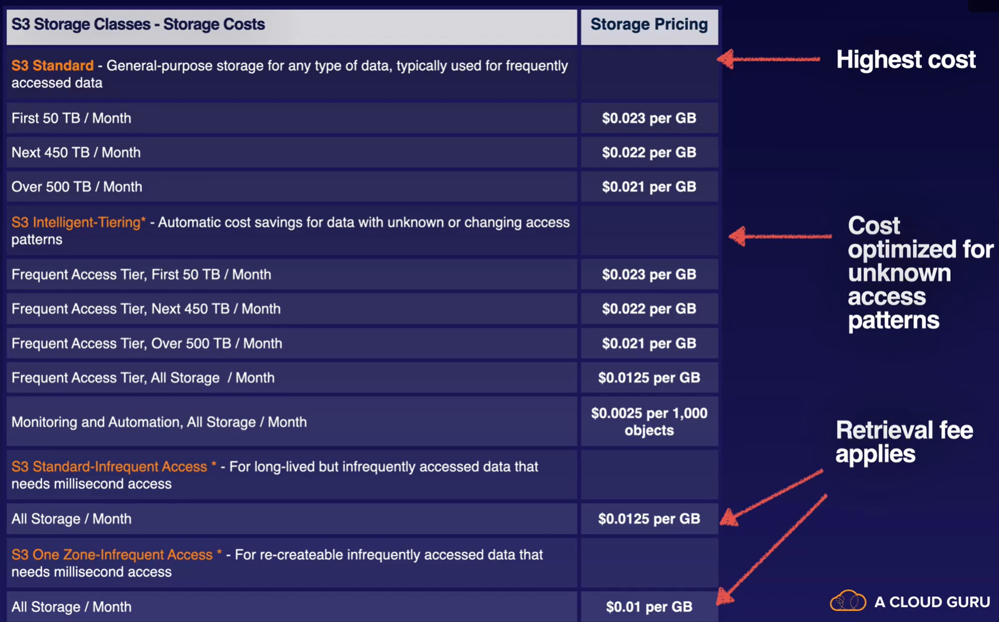
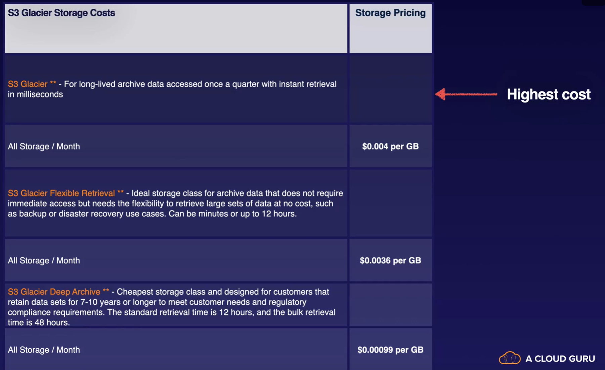

# AWS Solution Architect - Associate (SAA-C03)

- [Introduction](#Introduction)
- [AWS Fundamentals](#aws-fundamentals)
- [Identity Access & Management (IAM)](#identity-access--management)
- [Simple Storage Service (S3)](#simple-storage-service-s3)


## Introduction
Exam Pattern

- Design Resilient Arch - 26%
- Design High Performing Arch - 24%
- Design Secure Arch - 30%  *****IMP******
- Design Cost-Optimized Arch - 20%

Passing Mark - 725/1000
65 Questions/ 135 Minutes

## AWS Fundamentals

- Building blocks of AWS
    - Region - Its a geographical/physical location consists of 2 or more Availability Zones
    - Availability Zone - It is a one or more discrete data centers in a particular region 
    - Edge location - It is an AWS endpoints for caching and serving static content
    - More edge locations than regions

- Shared responsibility model
    - AWS/ You/ Shared(Encryption)
    - can you do it yourself through AWS Mgmt console ??

- AWS Key services
    - Compute - EC2, Lambda, Elastic Beanstalk
    - Storage - S3, EBS, EFS, FSx, Storage gateway
    - Database - DynamoDB, RDS, Redshift
    - Networking - VPN, Direct Connet, API Gateway, Route 53, AWS Global Accelerator 

- Well-Architected Framework
    - 6 pillers of well-archietect framework
    - Opertional Excellence
    - Performance Efficiency
    - Cost optimization
    - Security
    - Reliability
    - Sustainability

## Identity Access & Management
- AWS Root account must be secured with 2-factor authentication
- Should create admin group with appropriate permissions and add user to it for Admin access
- IAM is a global service, its not specific to any region
- User, roles & groups are created at global level & available in all the regions
- User is created for each physical person (One user for one person)
- When user is created it provides Access key and scecet key for programmatic access
- Role is internal for AWS services (non-person entity)
- Permission is set of rules defined using IAM Policy Document that can be assinged to either user, role or group to define level of access.
- Example IAM Policy Document
```
{
    "version":"2012-10-17",
    "Statement":[
        {
            "Effect":"Allow",
            "Action":"*",
            "Resource":"*"
        }
    ]
}
```
- Ability for IAM Federation & Identity Federation

## Simple Storage Service (S3)

- S3 Overview
    - Its an object based storage, suited for flat files.
    - Its a key-value based storage, where key is file/object name and value is actual file/object
    - Its an universal service, bucket name needs to be unique across all the regions
    - Object upto 5TB in size can be stored
    - S3 provides convenient Web APIs to access files 
        - S3 URL Format: http://<<bucketName>>.s3.<<regionName>>.awsamazon.com/<<objectKey>>
    - S3 is Great option for hosting static websites

- Securing S3 Bucket
    - Provides "Block public access" option to secure bucket 
    - By default, S3 bucket is created with no public access
    - Make S3 objects publicly available is 2 step process
        - Remove "Block public access" settings at bucket level
        - Enable public access on indvidual object OR apply policy to all the objects in the given bucket 
    
 - Hosting static websites using S3
    - Enable public access
    - Enable "Static Website" option in S3 bucket
    - Configure index.html & error.html
    - Provides auto-scaling
    - e.g - Publish movie trailers, host media contents

- Versioning in S3
    - Enable version option in S3 bucket
    - Once enabled, can not be disabled again. It can only be suspended.
    - Old/ deleted versions of the files are stored
    - When deleted, delete marker is applied on the object and can only be visible with "List Version" option
    - By removing delete marker object version, object can be restored
    - The initial version of the object has "null" version

- S3 Stroage classes
    - Below chart summarizes differnt S3 storage classes & their Availability, Durability & Usage.
    
    - Below charts summarizes cost structure
    
    

- Lifecycle management with S3
    - Helps automate moving objects to different storage tiers
    - Can be used in conjunction with Versioning
    - Can be applied to current version as well as previous version
    - You can configure rules such as when and which tier objects to move to

- S3 Object lock & Glacior voult lock
    - S3 Object lock allows you to apply WORM(Write Once Read Many) model on objects
    - Objects lock can be applied at bucket level or individual object level
    - 2 modes of object lock
        - Compliance - No one allowed to overwrite or delete an object once written
        - Governance - Exceptional users like root users are allowed to overwrite or delete an object
    - Legal hold
    - S3 Glacior lock
        - Glaciar storage with S3 object lock on it i.e. objects in Glaciar vault can not overwritten or deleted.

- Encrypting S3 objects
    - Encryption in transit
        - SSL
        - HTTPS
    - Encryption at rest
        - Server Side Encryption - This applied just before uploading object into S3 
            - SSE S3 Using(AES 256) - AWS Managed Keys
            - SSE KMS - Encryption key is stored in KMS
            - SSE C (Customer Managed Key)- Encryption key is managed by the customer
        - Client Side Encryption - Object is encypted at clientside itself & then uploaded into S3
    - Encryption can be enforced using Bucket policy
        - PUT requests are denied if x-amz-server-side-encryption header is not present in the request
            
- Optimizing S3 Performance
    - Apply prefixes by creating appropriate bucket structure (Sub-folders)
    - Achieve high number of requests 
        - 3500 PUT/POST/DELETE requests per second
        - 11000 GET requests per second
    - Spread your reads accross multiple prefixes to get betters results
        - if we are using 2 prefixes then 7000 PUT/POST & 22000 GET per second
    - S3 Multipart upload
        - recommended to use multipart upload for files more than 100MB. Must be used for 5GB & above
    - S3 Byte-range fetches

- Backing up data with S3 Bucket Replication
    - Allows you replicate your objects from one bucket into another in the same or different regions
    - Versioning must be enabled for Replication to work
    - Existing objects are not replicated automatically after turning on Replication
    - Delete markers are not replicated by default, need to turn on seperately