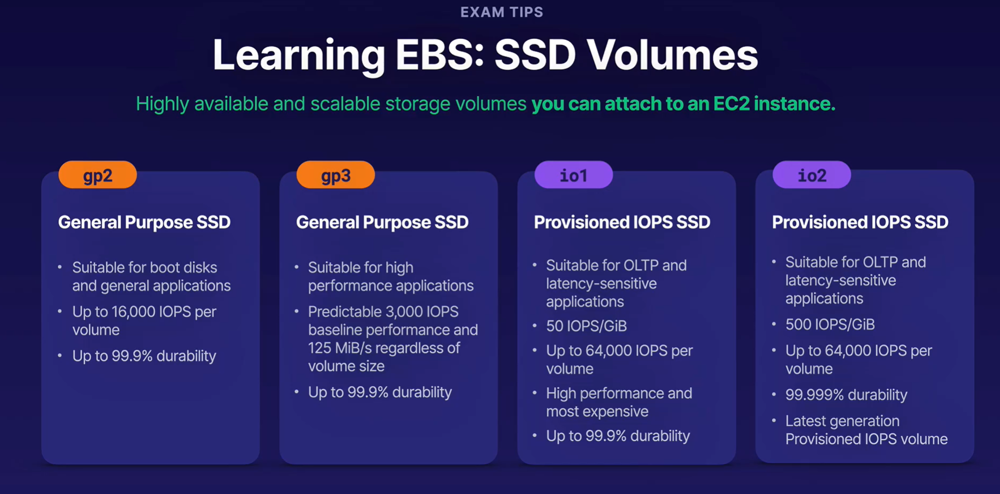
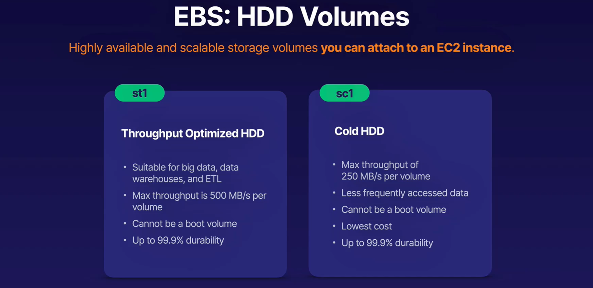

# AWS Solution Architect - Associate (SAA-C03)

- [Introduction](#Introduction)
- [AWS Fundamentals](#aws-fundamentals)
- [Identity Access & Management (IAM)](#identity-access--management)
- [Simple Storage Service (S3)](#simple-storage-service-s3)
- [Elastic Compute Cloud(EC2)](#elastic-compute-cloud-ec2)
- [Elastic Block Store(EBS) & Elastic File System(EFS))](#elastic-block-storeebs--elastic-file-systemefs)
- [Databases](#databases)


## Introduction
Exam Pattern

- Design Resilient Arch - 26%
- Design High Performing Arch - 24%
- Design Secure Arch - 30%  *****IMP******
- Design Cost-Optimized Arch - 20%

Passing Mark - 725/1000
65 Questions/ 135 Minutes

## AWS Fundamentals

- Building blocks of AWS
    - Region - Its a geographical/physical location consists of 2 or more Availability Zones
    - Availability Zone - It is a one or more discrete data centers in a particular region 
    - Edge location - It is an AWS endpoints for caching and serving static content
    - More edge locations than regions

- Shared responsibility model
    - AWS/ You/ Shared(Encryption)
    - can you do it yourself through AWS Mgmt console ??

- AWS Key services
    - Compute - EC2, Lambda, Elastic Beanstalk
    - Storage - S3, EBS, EFS, FSx, Storage gateway
    - Database - DynamoDB, RDS, Redshift
    - Networking - VPN, Direct Connet, API Gateway, Route 53, AWS Global Accelerator 

- Well-Architected Framework
    - 6 pillers of well-archietect framework
    - Opertional Excellence
    - Performance Efficiency
    - Cost optimization
    - Security
    - Reliability
    - Sustainability

## Identity Access & Management
- AWS Root account must be secured with 2-factor authentication
- Should create admin group with appropriate permissions and add user to it for Admin access
- IAM is a global service, its not specific to any region
- User, roles & groups are created at global level & available in all the regions
- User is created for each physical person (One user for one person)
- When user is created it provides Access key and scecet key for programmatic access
- Role is internal for AWS services (non-person entity)
- Permission is set of rules defined using IAM Policy Document that can be assinged to either user, role or group to define level of access.
- Example IAM Policy Document
```
{
    "version":"2012-10-17",
    "Statement":[
        {
            "Effect":"Allow",
            "Action":"*",
            "Resource":"*"
        }
    ]
}
```
- Ability for IAM Federation & Identity Federation

## Simple Storage Service (S3)

- S3 Overview
    - Its an object based storage, suited for flat files.
    - Its a key-value based storage, where key is file/object name and value is actual file/object
    - Its an universal service, bucket name needs to be unique across all the regions
    - Object upto 5TB in size can be stored
    - S3 provides convenient Web APIs to access files 
        - S3 URL Format: http://<<bucketName>>.s3.<<regionName>>.awsamazon.com/<<objectKey>>
    - S3 is Great option for hosting static websites

- Securing S3 Bucket
    - Provides "Block public access" option to secure bucket 
    - By default, S3 bucket is created with no public access
    - Make S3 objects publicly available is 2 step process
        - Remove "Block public access" settings at bucket level
        - Enable public access on indvidual object OR apply policy to all the objects in the given bucket 
    
 - Hosting static websites using S3
    - Enable public access
    - Enable "Static Website" option in S3 bucket
    - Configure index.html & error.html
    - Provides auto-scaling
    - e.g - Publish movie trailers, host media contents

- Versioning in S3
    - Enable version option in S3 bucket
    - Once enabled, can not be disabled again. It can only be suspended.
    - Old/ deleted versions of the files are stored
    - When deleted, delete marker is applied on the object and can only be visible with "List Version" option
    - By removing delete marker object version, object can be restored
    - The initial version of the object has "null" version

- S3 Stroage classes
    - Below chart summarizes differnt S3 storage classes & their Availability, Durability & Usage.
    
    - Below charts summarizes cost structure
    
    

- Lifecycle management with S3
    - Helps automate moving objects to different storage tiers
    - Can be used in conjunction with Versioning
    - Can be applied to current version as well as previous version
    - You can configure rules such as when and which tier objects to move to

- S3 Object lock & Glacior voult lock
    - S3 Object lock allows you to apply WORM(Write Once Read Many) model on objects
    - Objects lock can be applied at bucket level or individual object level
    - 2 modes of object lock
        - Compliance - No one allowed to overwrite or delete an object once written
        - Governance - Exceptional users like root users are allowed to overwrite or delete an object
    - Legal hold
    - S3 Glacior lock
        - Glaciar storage with S3 object lock on it i.e. objects in Glaciar vault can not overwritten or deleted.

- Encrypting S3 objects
    - Encryption in transit
        - SSL
        - HTTPS
    - Encryption at rest
        - Server Side Encryption - This applied just before uploading object into S3 
            - SSE S3 Using(AES 256) - AWS Managed Keys
            - SSE KMS - Encryption key is stored in KMS
            - SSE C (Customer Managed Key)- Encryption key is managed by the customer
        - Client Side Encryption - Object is encypted at clientside itself & then uploaded into S3
    - Encryption can be enforced using Bucket policy
        - PUT requests are denied if x-amz-server-side-encryption header is not present in the request
            
- Optimizing S3 Performance
    - Apply prefixes by creating appropriate bucket structure (Sub-folders)
    - Achieve high number of requests 
        - 3500 PUT/POST/DELETE requests per second
        - 11000 GET requests per second
    - Spread your reads accross multiple prefixes to get betters results
        - if we are using 2 prefixes then 7000 PUT/POST & 22000 GET per second
    - S3 Multipart upload
        - recommended to use multipart upload for files more than 100MB. Must be used for 5GB & above
    - S3 Byte-range fetches

- Backing up data with S3 Bucket Replication
    - Allows you replicate your objects from one bucket into another in the same or different regions
    - Versioning must be enabled for Replication to work
    - Existing objects are not replicated automatically after turning on Replication
    - Delete markers are not replicated by default, need to turn on seperately

## Elastic Compute Cloud (EC2)

- EC2 Overview
    - Amazon compute service with pay as you go model
    - Its a virtual machine running on Physical server in the cloud
    - Uses hypervisor technology
    - Provides compute on demand, grows and shrinks as needed
    - Machine can be provisioned and managed with few clicks and Web API calls
    - Types of EC2
        - On demand instances
            - Great flexibility, no committments, instances can be released anytime 
        - Reserved instances
            - Reserved for 1-3 years, Longer the committment lesser the prices, 
            - cost effective, cost savings upto 72%
        - Spot instances
            - Unused compute capacities are put for auction for certain time period use
            - Prices fluctuate with supply and demand, stock prices analogy
            - cost savings upto 90%
            - suitable for non-critical job like sunday night job having flexible start and end time
        - Dedicated hosts
            - Compliance and licensing requirement
            - Not allowed to share physical servers with any other hosts
            - e.g Banking softwares
            - Most expensive option

- EC2 creation major steps
    - Select Operating System / AMI (Amazon Machine Image)
    - Select CPU / Instance type
    - Provide instance details
        - no of Instances
        - VPC
        - Subnet / Availaibility zone
    - Add storage
    - Add tags
    - Configure security group
        - configure ports 
    - Congifure secret key pair for SSH
        - Use existing or create new one

- AWS Command Line Access
    - Install AWS CLI
    -  Get the programmatice access keys from AWS console for the user
    - Configure access keys to connect through CLI
        > aws configure

- Using Roles
    - Roles allow one AWS servce to access another service in the same or different account.
    - Eliminates need of programmatic access keys
    - Great option to provide temporary access

- Security Groups
    - virtual firewalls for EC2 instance
    - By default all the accesses to EC2 are blocked
    - need to open up ports to all/ some IPs 
    - 0.0.0.0/0 - To let everyone in
    - Common ports
        - HTTP : 80
        - HTTPS : 443
        - SSH : 22
        - RDP : 3389

- Bootstrap script
    - Script that runs when EC2 instance first runs.
    - You can provide this script as part of User Data while setting up EC2 instance.
    - Adds an extra time to instance startup
    - Usage
        - Automates installation of applications

- User Data & Meta Data
    - User data is simply Bootstrap script
    - Meta Data is data about data i.e data about the EC2 instance
    - How to access User data
        - https://169.254.169.254/latest/user-data
    - How to access EC2 meta data 
        - https://169.254.169.254/latest/meta-data
        - provides bunch of meta-data options
        - e.g - https://169.254.169.254/latest/meta-data/public-ipv4
    - You can access meta-data from user-data(Bootstrap script)

- Networking with EC2
    - ENI (Elastic Network Interface)
        - Comes as default with EC2
        - Used for basic networking
    - Enhanced Networking
        - Provides higher bandwidth and low inter-instance latencies
        - Can be attached to EC2 in 2 ways
            - ENA (Enhanced Network Adapter) - Speed upto 100 GBPS
            - VF (Intel 82599 Virtual Function Interface) - Speed up to 10 GBPS
    - EFA (Elastic Fabric Adapter)
        - Used for High Performance Computing(HPC) and Machine Learning workload
        - A lot faster with much lower latency
        - Supports OS-bypass to enable faster speed and lower latency - only supported by Linux

- Optimizing with EC2 Placement Groups
    - Cluster Placement Group
        - Grouping of instances within same Availability Zone.
        - Used when instances need high network throughput and low latency
    - Spread Placement Group
        - Grouping of instances on seperate hardware to isolate impact of failure
        - Used for applications with small number of critical instances
        - e.g Database's primary and secondary instances
    - Partition Placement Group
        - Grouping of EC2 instances using seperate racks again to isolate imapact of failure 
        - Each rack will have its own network and power sources
        - Used for multiple instances grouped together on a single Rack

- Timing workloads with Spot instances
    - Spot instances allows to you to provision unused compute capacity for cheaper prices
    - Could be terminated at any time
    - Good for non-critical, fault-tolerant, repeatable workload
    - Provides upto 90% of cost savings
    - Spot Fleet
        - Enables to you to provision given compute capcity using spot instances and optionally on-demand instances
        - Different strategies can specified for provisioning
            - capacityOptimized
            - diversified
            - costOptimized(Default)
            - instancePoolsToUseCount

- VMWare Cloud in AWS
    - VMWare has existed before AWS
    - VMWare is used by Organizations for private cloud deployments. 
    - Good for lift & shift migration, hybrid cloud strategy, disaster recovery(VMWware famous for) and leverage AWS Services
    - Perfect option for extending private VMware cloud to AWS public cloud.

- AWS Outposts
    - Helps extend AWS services beyond public cloud
    - Brings AWS Data center directly to you, on-premises.
    - Outposts comes in sizes such 1U, 2U servers upto 42U Racks and multi-Racks deployment
    - Benefits
        - Hybrid cloud
        - Fully managed infrastructure by AWS
        - Consisteny with your environment
    - Outpost family members
        - Outpost Rack
            - Comes in capcity of 42U upto 96U Racks
            - Good for orgs data centers
            - Leverage AWS services with on-premise DC
        - Output Servers
            - Comes in 1U, 2U form factor
            - Good for small spaces like retail store, health care facility
            - Fully managed by AWS
    
## Elastic Block Store(EBS) & Elastic File System(EFS)
- EBS Overview
    - EBS is a virtual hard disk in the cloud that can be attached to EC2 instance 
    - Allows you to install Operating system, database systems and web servers etc.
    - Size of the EBS can be resized on the fly without needing server restart
    - EBS volume types
        - General purpose SSD (gp1)
        - General purpose SSD (gp2)
        - Provisioned IOPS SSD (io1)
        - Provisioned IOPS SSD (io2)
        - 
        - Throughput Optimized HDD 
        - Cold storage HDD
        - 

- Volumes and Snapshots
    - EBS Volume
        - You need minimum one EBS volume per EC2 instance called Root volume
        - EBS volumes will always be in the same AZ as EC2 to avoid latenycy
        - EBS can be resized on the fly, no restart needed.
        - EBS volume type can be switch on the fly, no restart needed.
    - EBS Snapshot - 
        - Its a point in time image of EBS volume
        - Snapshot exists on S3
        - It can be encrypted
        - Following needs to be done if you need to spin up new ec2 instance using snapshot -
            1. Create AMI(Amazon Machine Image) using snapshot
            2. Spin up new instance using AMI in the same or differnt region
        - EC2 instance can be migrated to another region by creating EBS snapshot and then copying snapshot to another region. Then, follow above steps to spin up new ec2 instance. 

- Encrypting existing EBS volumes
    - Create EBS Snapshot from the unencrypted EBS volume. 
    - Create a copy of this snapshot with encrypted option checked
    - Create AMI from encrpted snapshot
    - Spin up a new ec2 instance using this AMI. This instance will have protected/encrypted EBS volume.
    - When EBS volume is encrypted
    - Data is encrypted at rest.
    - Data is encrypted in flight with all communication encrypted between ec2 and EBS volume.
    - No impact on the performance due to encryption
    - Amazon provides below encryption techniques - 
        - Amazon EBS default encryption
        - KMS Key
        - Customer managed key

- EC2 Hibernation
    - When EC2 instance is stopped, data is kept on the disk until its restarted.
    - When EC2 is termintated, root EBS volume is also terminated.
    - Hibenation option helps EC2 to boot up faster and come back to state right before shutdown
    - When you hibernate the ec2 instance, it saves contents from instance store (RAM) along with active processes onto root BS volume.
    - When EC2 instance is started again, it won't go thorugh entire bootup process. Instead it will load its state from the EBS volume. Instance retains in instanceId.
    - This is helpful when you need EC2 instances to come up faster
    - Hibernation allows to save instance state for upto 60 days and upto 150Gb. 
    - Available for C and above grade instance family
    - Available for on-demand and reserved instances.
               
- EFS (Elastic File System)
    - Ita a Network File System based on NFSv4 protocol with pay what use model. It can scale upto petabytes.
    - Data is stored across multiple AZ.
    - Allows regional data sharing, amongst different AZs.
    - Highly available and scalable, expensive
    - Compatible with Linux AMIs (Not supported Windows yet).
    - Supports Encryption at rest.
    - Supports thousands of concurrent connnections, 10 GBPS throughput and Petabytes scaling.
    - It also supports Lifecycle management i.e moving the data across different storage based on its usage.

- FSx Overview
    - FSx for Windows - Allows to provision fully managed Windows file storage system format in the cloud
    - Used for Microsoft SQL server, Sharepoint or other windows based applications to cloud.
    - FSx for Windows Vs EFS
        - FSx - Windows | EFS - Unix/Linux
        - FSx supports AD Users & Groups, User access controls along with distributed file system namespaces and replication.
    - FSx for Lustre
        - Provides fully managed Windows file system for High performance and Comput-intensive applications.
    
- Amazon Machine Image: EBS Vs Instance store
    - AMI is a blueprint which has the info required to launch the instance.
    - AMI is based on 5 things
        - Region
        - Operating system
        - CPU Architecture 32/64 bit
        - Memory
        - Root storage volume (EBS vs Instance store)
    - AMI backed by EBS
        - Most commonly used
        - EC2 will have root volume on EBS
        - Provides consistent storage.
        - Root volume Data can be retained even after instance is terminated.
    - AMI backed by Instance store
        - EC2 will have root volume on Instance store (RAM)
        - Ephemeral in nature
        - If the underlying hardware fails or instance terminated, data is lost. Data is not lost during instance reboot.

- AWS Backup
    - Helps to manage backup of multiple AWS Services in an account
    - When combined with AWS Organizations, it helps to consolidate and centralize backup management of mutiple AWS accounts.

## Databases
- Relation Database Systems (RDS)
    - Relational database is collection of tables
        - Rows
        - Columns
    - Amazon RDS Supports following relational databases
        - Microsoft SQL Server
        - Oracle
        - MySQL
        - Postgresql
        - Mariadb
        - Amazon Aurora
    - OLTP vs OLAP
        - OLTP - Online Transaction Processing
        - OLAP - Online Analytics Processing
        - RDS is fit for Online Transaction Processing 
        - Redshit (Another flavor of database) is fit for data analytics and data warehousing.
    - Multi AZ
        - RDS supports multi AZ which means there are multiple instances of the database, one being primary and others standby in multiple availability zones.
        - Automatic failover to Standby DB instance in case of primary instance failure
        - MultiAZ is only useful for disaster recovery, NOT for boosting performance.

- Increase Read Performance using Read Replicas
    - Read eplicas are read-only databases 
    - Unlike multiAZ, Read replicas can be in cross-region
    - Used for boosting performance by minimizing read load on Primary database.
    - Read replicas can be promoted to primary DB, it would break replication
    - multiAZ vs Read Replica
        - Multi AZ helps with Disaster recovery.
        - Read Replica helps with boosting performance
        - Multi AZ is cross-AZ only
        - Read Replica can be corss-region.
        - Multi AZ has same url for primary and standby instances enabling automatic failover.
        - Read replicas has different urls than primary instance.

- Amazon Aurora
    - It is Amazon's properiety database compatible with MySQL and Posgresql
    - Provides 5x performance than MySQL & 3x than Postgresql
    - High Availablity - 2 copies are maintained in each of the 3 AZs, total 6 copies
    - Highly Scalable, starts with 10GiB, increments in factor of 10GiB upto 128TB
    - High compute scalablity, upto 96vCPU & 748GiB Memory
    - Replicas are maintained without any perfromance impact
    - Provides automated backups
    - Database snapshots can shared cross regions
    - Amazon Aurora Serverless
        - On demand provision of the database with auto start & stop feature 
        - Good for spike usage 

- DynamoDB
    - This is also Amazon's properiety NoSQL database
    - Managed service
    - supports both key-value and documents format
    - You pay per request, not charged for storage
    - Provides with eventual consistency, can get strong consistency
    - Copies stored in 3 geographically distint data centers.

- DynamoDB Transactions
    - What is ACID
        - Atomicity, Consistency, Isolation and Durable
    - ACID with DynamoDB
        - Enable DynamoDB Transations option to use ACID properties
        - Supports ACID on a transaction per region and per AWS account.
    - Supports All or Nothing transactions
        - meaning either everything is committed
        - Or everything is rolled back in case of any failure in intermediate transaction

- DynamoDB Backup and Recovery
    - On Demand Backup and Restore
        - Full backups at any time
        - backup is taken in an incremental fashion
        - Zero impact on table performance
        - Consistent within seconds
        - Backup table within the same region as source table
    - Point In Time Recovery(PITR)
        - Restore to anypoint within last 35 days
        - Latest PITR - 5 mins in the past

- Taking you data global with DynamoDB Streams and Global Tables
    - What are streams
        - Series of events related to data update to the table, divided in the shards 
        - Can be subscribed to
        - Available upto 24hrs
    - What are global tables
        - multi-master & mutli-region replication
        - Good for globally distributed apps 
        - Built in - no application rewrites
        - replication within a second
    - Delete replicas first then the primary table

- DocumentDB
    - What is MongoDB
        - Document-based nosql database
        - Provides scalability and flexibility to your data
        - stores json documents
    - What is DocumentDB
        - Amazon's fully managed service that helps run Mongodb database on cloud
    - Usa cases
        - Migrate on-premise mongodb workload on AWS cloud
        - If you have new requirement for Nosql datbase, you would rather go with DynamoDB.

- Amazon Keyspaces
    - What is Apache Cassandra
        - Distributed Nosql database
        - Useful for data warehousing and analytics
    - What is Amazon Keyspaces
        - Amazon's fully managed service to run Cassandra workload on AWS cloud.
    - Use cases
        - Netflix usage data
        - Product catalog & inventory

- Implementing Graph databases using Amazon Neptune
    - What is Graph database
        - stores data as nodes and relationships between them
    - What is Amazon Neptune
        - Amazon's graph database implementation
    - Use cases
        - Recommendation engine
        - Social interactions

- Analysing Time-Series data with Amazon Timestream
    - What is Time-Series Data
        - Stores data as series of points during particular time period
    - What is Amazon Timestream
        - Amazon's Time-Series database implemenation
    - Use cases 
        - IOT streams